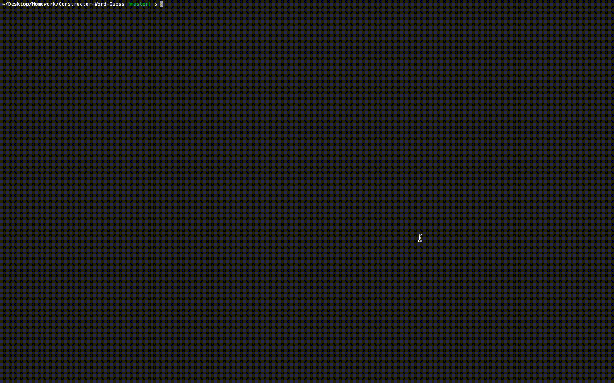

# Constructor-Word-Guess

## How to Play
* Navigate to the root of game in your terminal
* Start the game by entering `node index.js`
* The game will then print out a series of underscores to represent the cities or states title to be predicted and ask you to "Guess a letter:" 

## Technologies used
1. Node.js
    * Constructors
    * [Inquirer](https://www.npmjs.com/package/inquirer)
    * [Chalk](https://www.npmjs.com/package/chalk)

## Constructor Word Guess in Action:

## License
Standard MIT License

## Author
Minal Kharche